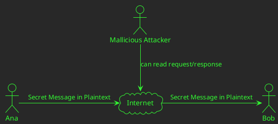
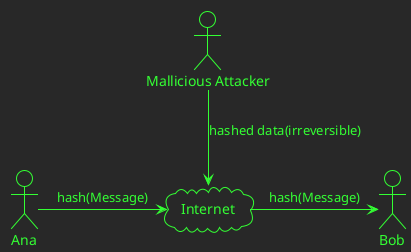

# Cryptography for Developers.

## ECIES example:
https://github.com/pritamprasd/poc-encrypt-flask-reactjs

### Encrypt data between UI(browser-sandbox) and Backend. 
- https://github.com/pritamprasd/poc-encrypt-flask-reactjs/blob/two_way_encryption/comm.svg
- 

### Considerations:
1. Secure Enough?
-  <br/> src: https://nvlpubs.nist.gov/nistpubs/SpecialPublications/NIST.SP.800-57Pt3r1.pdf ,  https://apps.nsa.gov/iaarchive/programs/iad-initiatives/cnsa-suite.cfm
- <br/>
src: http://ww1.microchip.com/downloads/en/DeviceDoc/00003442A.pdf
- `How secure is 265-bit`: https://www.youtube.com/watch?v=S9JGmA5_unY
- key length recommendation: https://www.keylength.com/en/4/ 

2. Performance on Key-generation:
<br/>
src: [RSA and ECC: A Comparative Analysis](https://www.ripublication.com/ijaer17/ijaerv12n19_140.pdf)

3. ECC JS Support:
- Issues:
    - WebAPIS: https://developer.mozilla.org/en-US/docs/Web/API/SubtleCrypto, no ECC, only RsaOAEP.
    - Other libs: don't have flexibility for ecies
    - Performance is terribly slow.
- Solution:
    - Rust implementation of ecies: https://docs.rs/ecies/latest/ecies/
    - WASM: https://github.com/ecies/rs-wasm


## Fundamentals:
### Problem:

### Solution 1: Hashed payload

#### Cryptographical Hash Functions:

- `collision-resistant` and `irreversible`
- `MD5`(deprecated), `SHA-1`(deprecated),`SHA(SHA3-256, SHA-512)`, `BLAKE2s`, `RIPEMD-160`, `SM3`, `GOST`
- PoW Hash functions: `ETHash`(Ethereum), `Equihash`(Bitcoin Gold, Zcash)
- Breaking SHA-1: https://shattered.io/
- Playground: https://www.fileformat.info/tool/hash.htm
- `Merkle–Damgård construction`: https://eng.libretexts.org/Under_Construction/Book%3A_The_Joy_of_Cryptography_(Rosulek)/Chapter_12%3A_Hash_Functions/12.3%3A_Merkle-Damg%C3%A5rd_Construction 


### Solution 2: Encrypt with a key.
```plantuml
@startuml
skinparam defaultTextAlignment center
!define ICONURL https://raw.githubusercontent.com/tupadr3/plantuml-icon-font-sprites/v2.4.0
!includeurl ICONURL/common.puml
!include ICONURL/font-awesome/key.puml
!theme crt-green
actor "Ana" as A 
actor Bob as B
actor "Mallicious Attacker" as H
cloud Internet as I
A -r-> I : Encrypted text with key
I -r-> B : Encrypted text with key
H -d-> I : encrypted garbage
FA_KEY(key,key,label) #Yellow
FA_KEY(key2,key,label) #Yellow
key ~u~ A 
key2 ~u~ B
@enduml
```
#### Symmetric Encryption: 
`AES-256-GCM, AES-128-CTR`, `Serpent-128-CBC`
- Algorithm: AES, ChaCha20, Twofish, Serpent, Camellia
  - `AES`:
    - `key-length` 128, 192 or 256-bit.
    - input & output : 128 bit 
    - https://nvlpubs.nist.gov/nistpubs/FIPS/NIST.FIPS.197.pdf
- Block Cipher modes: repeatedly apply a cipher's single-block encryption.
  - `ECB`: encrypts equal input blocks as equal output blocks. **Do NOT use it**
  - `CBC`: works in block of fixed size; thus require padding (`PKCS7`/ `ANSI X.923`), `IV` is used to provide randomness.
    - `PKCS7`: The value of each added byte is the number of bytes that are added(N bytes, each of value N are added).
  - `CTR`: No `IV` needed, Counter acts as source of randomness. (XOR between portions of the plaintext and the internal cipher's state(no padding needed))
  - `GCM`: `CTR` + `MAC`, generates `auth-code` while encryption.
    - `MAC`: HMAC(key, msg, hash_func) -> hash
  - https://www.highgo.ca/2019/08/08/the-difference-in-five-modes-in-the-aes-encryption-algorithm/
- `KDF`: Deriving Key from Password `Bcrypt`, `Scrypt`. 


### Solution 3: Encrypt with asymmetric keypair.
- diasgram
- Issue: performance
- 

### Solution 4: Utilize Key Exchange to share a symmetric key.

### Solution 5: Use certs to proove identity

### ECIES:


## Links:
- Bitcoin address generator: https://www.bitaddress.org
- 


