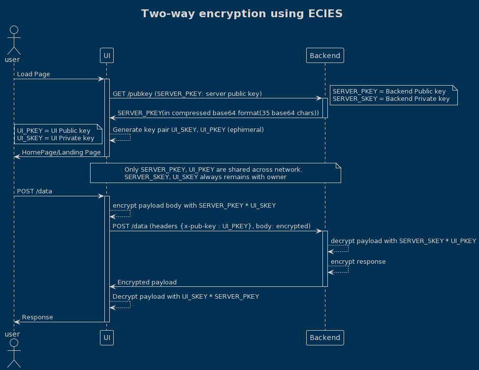
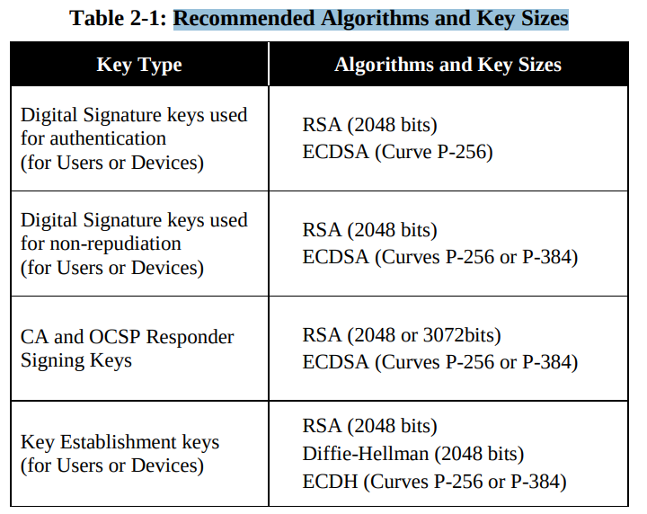
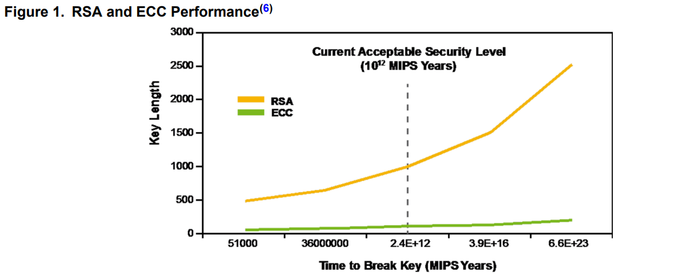
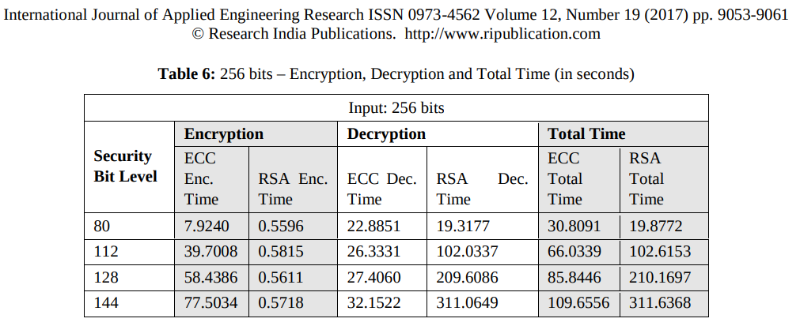

# Cryptography for Developers.

## ECIES example:
https://github.com/pritamprasd/poc-encrypt-flask-reactjs

### Encrypt data between UI(browser-sandbox) and Backend. 
- https://github.com/pritamprasd/poc-encrypt-flask-reactjs/blob/two_way_encryption/comm.svg
- 

### Considerations:
1. Secure Enough?
-    src: https://nvlpubs.nist.gov/nistpubs/SpecialPublications/NIST.SP.800-57Pt3r1.pdf ,  https://apps.nsa.gov/iaarchive/programs/iad-initiatives/cnsa-suite.cfm
-  
src: http://ww1.microchip.com/downloads/en/DeviceDoc/00003442A.pdf
- `How secure is 265-bit`: https://www.youtube.com/watch?v=S9JGmA5_unY
- key length recommendation: https://www.keylength.com/en/4/ 

2. Performance on Key-generation:
 
src: [RSA and ECC: A Comparative Analysis](https://www.ripublication.com/ijaer17/ijaerv12n19_140.pdf)

3. ECC JS Support:
- Issues:
    - WebAPIS: https://developer.mozilla.org/en-US/docs/Web/API/SubtleCrypto, no ECC, only RsaOAEP.
    - Other libs: don't have flexibility for ecies
    - Performance is terribly slow.
- Solution:
    - Rust implementation of ecies: https://docs.rs/ecies/latest/ecies/
    - WASM: https://github.com/ecies/rs-wasm

## Fundamentals:
### Problem:

