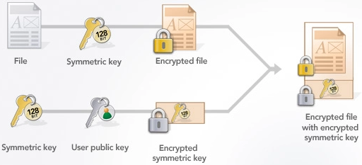

# Cryptography for Developers.

- [Cryptography for Developers.](#cryptography-for-developers)
  - [ECIES example](#ecies-example)
    - [Considerations](#considerations)
    - [Solution with ECIES](#solution-with-ecies)
  - [Problem statement](#problem-statement)
  - [Solution 1: Hashed payload](#solution-1-hashed-payload)
    - [Cryptographical Hash Functions:](#cryptographical-hash-functions)
  - [Solution 2: Encrypt with a key.](#solution-2-encrypt-with-a-key)
    - [Symmetric Encryption:](#symmetric-encryption)
      - [Algorithm: AES, ChaCha20, Twofish, Serpent, Camellia](#algorithm-aes-chacha20-twofish-serpent-camellia)
      - [Block Cipher modes: repeatedly apply a cipher's single-block encryption.](#block-cipher-modes-repeatedly-apply-a-ciphers-single-block-encryption)
      - [`KDF`: Deriving Key from Password `Bcrypt`, `Scrypt`.](#kdf-deriving-key-from-password-bcrypt-scrypt)
  - [Solution 3: Encrypt with asymmetric keypair.](#solution-3-encrypt-with-asymmetric-keypair)
    - [Asymmetric KeyPair: RSA(1977), ECC(2004-05)](#asymmetric-keypair-rsa1977-ecc2004-05)
      - [`RSA`](#rsa)
      - [`ECC`](#ecc)
  - [Solution 4: Utilize Key Exchange to establish a symmetric key(hybrid encryption).](#solution-4-utilize-key-exchange-to-establish-a-symmetric-keyhybrid-encryption)
    - [`ECDH`](#ecdh)
    - [`ECIES`: ECDH + AES_GCM_128 + MAC](#ecies-ecdh--aes_gcm_128--mac)
  - [Solution 5: Sign message with Encryption:](#solution-5-sign-message-with-encryption)
  - [Links:](#links)

## ECIES example
https://github.com/pritamprasd/poc-encrypt-flask-reactjs

### Considerations
1. Secure Enough?
-  <br/> src: https://nvlpubs.nist.gov/nistpubs/SpecialPublications/NIST.SP.800-57Pt3r1.pdf ,  https://apps.nsa.gov/iaarchive/programs/iad-initiatives/cnsa-suite.cfm
- <br/>
src: http://ww1.microchip.com/downloads/en/DeviceDoc/00003442A.pdf
- `How secure is 265-bit`: https://www.youtube.com/watch?v=S9JGmA5_unY
- key length recommendation: https://www.keylength.com/en/4/ 

2. Performance on Key-generation:
- <br/>
src: [RSA and ECC: A Comparative Analysis](https://www.ripublication.com/ijaer17/ijaerv12n19_140.pdf)
- https://www.cryptopp.com/benchmarks.html

3. ECC JS Support:
- Issues:
    - WebAPIS: https://developer.mozilla.org/en-US/docs/Web/API/SubtleCrypto, no ECC, only RSAOAEP.
    - Other libs: don't have flexibility for ecies
    - Performance is terribly slow.
- Solution:
    - Rust implementation of ecies: https://docs.rs/ecies/latest/ecies/
    - WASM: https://github.com/ecies/rs-wasm
### Solution with ECIES

src: https://github.com/pritamprasd/poc-encrypt-flask-reactjs/blob/two_way_encryption/comm.svg 

## Problem statement

> wireshark demo
## Solution 1: Hashed payload

### Cryptographical Hash Functions:

- `collision-resistant` and `irreversible`
- `MD5`(deprecated), `SHA-1`(deprecated),`SHA(SHA3-256, SHA-512)`, `BLAKE2s`, `RIPEMD-160`, `SM3`, `GOST`
- PoW Hash functions: `ETHash`(Ethereum), `Equihash`(Bitcoin Gold, Zcash)
- Playground: https://www.fileformat.info/tool/hash.htm
- Breaking SHA-1: https://shattered.io/
- `Merkle–Damgård construction`: https://eng.libretexts.org/Under_Construction/Book%3A_The_Joy_of_Cryptography_(Rosulek)/Chapter_12%3A_Hash_Functions/12.3%3A_Merkle-Damg%C3%A5rd_Construction 


## Solution 2: Encrypt with a key.
```plantuml
@startuml
skinparam defaultTextAlignment center
!define ICONURL https://raw.githubusercontent.com/tupadr3/plantuml-icon-font-sprites/v2.4.0
!includeurl ICONURL/common.puml
!include ICONURL/font-awesome/key.puml
!theme crt-green
actor "Ana" as A 
actor Bob as B
actor "Mallicious Attacker" as H
cloud Internet as I
A -r-> I : Encrypted text
I -r-> B : Encrypted text 
H -d-> I : encrypted garbage
FA_KEY(key,key,label) #Yellow
FA_KEY(key2,key,label) #Yellow
key ~r~ A 
key2 ~l~ B
@enduml
```
```plantuml
@startuml Problem
skinparam defaultTextAlignment center
!define ICONURL https://raw.githubusercontent.com/tupadr3/plantuml-icon-font-sprites/v2.4.0
!includeurl ICONURL/common.puml
!include ICONURL/font-awesome/key.puml
!theme crt-green
file "Plaintext" as PT #navy
file "CipherText" as CT #gray
rectangle "Symmetric Encryption" as H
FA_KEY(key,key,label) #Yellow
key -d-> H : key
PT -r-> H:  text or binary data
H -r-> CT:  encrypted blob
@enduml
```
### Symmetric Encryption: 
`AES-256-GCM, AES-128-CTR`, `Serpent-128-CBC`
#### Algorithm: AES, ChaCha20, Twofish, Serpent, Camellia
  - `AES`:
    - `key-length` 128, 192 or 256-bit.
    - input & output : 128 bit 
    - https://nvlpubs.nist.gov/nistpubs/FIPS/NIST.FIPS.197.pdf
#### Block Cipher modes: repeatedly apply a cipher's single-block encryption.
  - `ECB`: encrypts equal input blocks as equal output blocks. **Do NOT use it**
  - `CBC`: works in block of fixed size; thus require padding (`PKCS7`/ `ANSI X.923`), `IV` is used to provide randomness.
    - `PKCS7`: The value of each added byte is the number of bytes that are added(N bytes, each of value N are added).
  - `CTR`: No `IV` needed, Counter acts as source of randomness. (XOR between portions of the plaintext and the internal cipher's state(no padding needed))
  - `GCM`: `CTR` + `MAC`, generates `auth-code` while encryption.
    - `MAC`: HMAC(key, msg, hash_func) -> hash
  - https://www.highgo.ca/2019/08/08/the-difference-in-five-modes-in-the-aes-encryption-algorithm/
#### `KDF`: Deriving Key from Password `Bcrypt`, `Scrypt`. 


## Solution 3: Encrypt with asymmetric keypair.
```plantuml
@startuml
skinparam defaultTextAlignment center
!define ICONURL https://raw.githubusercontent.com/tupadr3/plantuml-icon-font-sprites/v2.4.0
!includeurl ICONURL/common.puml
!include ICONURL/font-awesome/key.puml
!include ICONURL/font-awesome/key.puml
!theme crt-green
actor "Ana" as A 
actor Bob as B
actor "Mallicious Attacker" as H
cloud Internet as I
B ~l~> I : Get Bob's Public key
I ~l~> A : Public Key <&key>
H -d-> I : encrypted blob
A -r-> I : Encrypted text
I -r-> B : Encrypted text 
FA_KEY(pk,Public Key,label) #Yellow
FA_KEY(pk2,Public Key,label) #Yellow
FA_KEY(sk,Private Key,label) #Orange
pk ~u~ B
pk2 ~u~ A
sk ~u~ B
@enduml
```
```plantuml
@startuml Problem
skinparam defaultTextAlignment center
!define ICONURL https://raw.githubusercontent.com/tupadr3/plantuml-icon-font-sprites/v2.4.0
!includeurl ICONURL/common.puml
!include ICONURL/font-awesome/key.puml
!theme crt-green
file "Plaintext" as PT #navy
file "CipherText" as CT #gray
rectangle "Symmetric Encryption" as H
FA_KEY(pk,"Public Key",label) #Yellow
pk -d-> H : key
PT -r-> H:  text or binary data
H -r-> CT:  encrypted blob
@enduml
```
```plantuml
@startuml Problem
skinparam defaultTextAlignment center
!define ICONURL https://raw.githubusercontent.com/tupadr3/plantuml-icon-font-sprites/v2.4.0
!includeurl ICONURL/common.puml
!include ICONURL/font-awesome/key.puml
!theme crt-green
file "Plaintext" as PT2 #navy
file "CipherText" as CT2 #gray
rectangle "Symmetric Decryption" as H2
FA_KEY(sk,"Private Key",label) #Orange
sk -d-> H2 : key
CT2 -r-> H2: encrypted blob
H2 -r-> PT2: decrypted plaintext
@enduml
```
### Asymmetric KeyPair: RSA(1977), ECC(2004-05)
- Two keys, mathematically related, `Impossible to generate Private Key from Public Key`
- `encryption`, `decryption`, `signing`, `verifying`, `key-generation`
#### `RSA`
  - Key generation: find three very large positive integers `e`, `d`, and `n`, such that for all integers `m` (with 0 ≤ m < n)  
    - public key: (n,e)
    - private key: (n,d)
  - Why hard to break? `n = pq` (`p` and `q` are very large prime numbers); given `n` it's hard to find `p`,`q`. (Integer factorization problem)
  - Encryption: `m**e (mod n)`
  - Decryption: `m**d (mod n)`
-  <br/>
src: https://www.ijemr.net/DOC/ComparativeAnalysisOfDESAESRSAEncryptionAlgorithms.pdf
- 


#### `ECC`
  - Elliptic Curves: (`secp256k1`, `secp256r1`)<br/>
    - <p float="left">
      
       
      </p>
    - Curve/Function: `y^2 = x^3 + ax +b` 
    - EC Curve: `y^2 = x^3 + ax +b` over a `finite field` + Generator Point(`G`)
      - `finite field` --> If `R = P + Q`, if `P` and `Q` lies in field , `R` too will lie on the field, 
        and there can be atmost one such `R`. (`n` : number of all points on field).
    - Playground: https://www.desmos.com/calculator/ialhd71we3
  - Key generation: `P = k * G`
    - `k` : private key : [0 .. n] (integer)
    - `P` : public key (Point)
  - Why hard to break? For a very large integer `k`, it’s very fast to calculate `P` = k * G ,  but extremely slow to calculate `k` if `G` and `P` are known.

> certs demo


## Solution 4: Utilize Key Exchange to establish a symmetric key(hybrid encryption).
- `DHKE`, `RSA-OAEP`, `ECDH`
```plantuml
@startuml
skinparam defaultTextAlignment center
!define ICONURL https://raw.githubusercontent.com/tupadr3/plantuml-icon-font-sprites/v2.4.0
!includeurl ICONURL/common.puml
!include ICONURL/font-awesome/key.puml
!theme crt-green
actor "Ana" as A 
actor Bob as B
actor "Mallicious Attacker" as H
cloud Internet as I
FA_KEY(pk,A's Public Key,label) #red
FA_KEY(sk,A's Private Key,label) #Yellow
FA_KEY(pk2,B's Public Key,label) #Blue
FA_KEY(sk2,B's Private Key,label) #Green
pk ~u~ A
sk ~u~ A
pk2 ~u~ B
sk2 ~u~ B
B <~l~> I : Public Key exchange
I <~l~> A : Public Key exchange
H -d-> I : encrypted blob
@enduml
```
```plantuml
@startuml
skinparam defaultTextAlignment center
!define ICONURL https://raw.githubusercontent.com/tupadr3/plantuml-icon-font-sprites/v2.4.0
!includeurl ICONURL/common.puml
!include ICONURL/font-awesome/key.puml
!theme crt-green
actor "Ana" as A 
actor Bob as B
actor "Mallicious Attacker" as H
cloud Internet as I
rectangle "Shared secret" as RS
rectangle "Shared secret" as RS2
FA_KEY(pk,A's Public Key,label) #red
FA_KEY(sk,A's Private Key,label) #Yellow
FA_KEY(pk2,B's Public Key,label) #Blue
FA_KEY(sk2,B's Private Key,label) #Green
pk2 ~u~ A
sk ~u~ A
sk2 ~u~ B
pk ~u~ B
B <~l~> I : Encrypted Text
I <~l~> A : Encrypted Text
H -d-> I : encrypted blob
sk ~d~ RS
pk2 ~d~ RS
sk2 ~d~ RS2
pk ~d~ RS2
@enduml
```
### `ECDH`
### `ECIES`: ECDH + AES_GCM_128 + MAC
  - 

## Solution 5: Sign message with Encryption:
#TODO
Issue: How can Bob trust Ana? Ana obtains a refferal from a CA(Root CA in system).

## Links:
- Holy grail for this session: https://cryptobook.nakov.com/
- Bitcoin address generator: https://www.bitaddress.org
